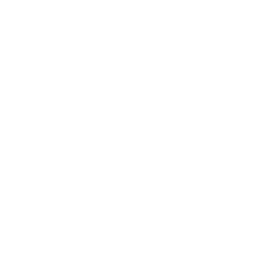

# Euphoria

**Euphoria** 是一款基于 [Dopamine](https://github.com/opa334/Dopamine)（MIT 协议）源码深度重构的全新 rootless 半不完美越狱工具。

## 支持范围

| 设备架构 | 系统版本 |
|---|---|
| **A12 / A13（arm64e，Vortex/Lightning）** | **iOS 15.0 – 18.7.6, 26.0 – 26.3.x（PPL 路线，支持区间最广）** |
| arm64e（A14 及以上旗舰） | iOS 15.0 – 17.3.1 |
| arm64（旧设备） | iOS 15.0 – 18.7.6 |

> **亮点**：A12 / A13 设备在 iOS 15.0 – 18.7.6 与 26.0 – 26.3.x 全区间均可越狱（momentarius A12/A13 专用漏洞路线），是本工具支持跨度最大的机型。

## 相比上游的主要变更

- **全新品牌标识**：应用更名 Euphoria，全新分子主题图标（5 套配色）、启动 Logo
- **全新代码命名空间**：类前缀 `DO*` → `EU*`（52 个类），bundle ID `dev.euphoria.Euphoria`，核心二进制 `euphoria`
- **全新运行时标识**：dyld UUID 魔术前缀 `DOPA` → `EUPH`，XPC 域 `JBS_DOMAIN_EUPHORIA`，环境变量 `EUPHORIA_*`，自有 Debian 包系（`libkrw0-euphoria` / `libroot-euphoria` / `euphoria-basebin-link`）
- **健壮性修复**：更新检查器对不存在的 GitHub 仓库（404）做了优雅降级
- **完整中文文档**：架构解析、构建指南、二次定制指南见 `docs/`

详细变更清单见 [CHANGES.md](CHANGES.md)。

## 构建前必读

1. 本项目为源码交付，**不提供预编译产物**。请阅读 [docs/BUILD.md](docs/BUILD.md) 自行构建。
2. 越狱需要有效签名身份（开发者证书 / AltStore / TrollStore 等任一自签方案）。
3. 默认更新源指向占位仓库 `euphoria-jb/Euphoria`，部署前请在 `EUUIManager.m` 与 `EUUpdateViewController.m` 中替换为你自己的发布地址。

## 免责声明

本项目仅供安全研究与个人设备定制学习。越狱会使设备脱离厂商安全模型，可能影响保修、数据安全与部分应用（银行类）运行。请在充分理解风险后自担使用。

## 致谢

- [opa334](https://github.com/opa334) — Dopamine 上游作者，本项目绝大部分核心代码的缔造者
- Dopamine 全体贡献者（见应用内 Settings → Credits 完整名单）
- Fugu15、kfd、XPF、ChOma 等公开研究成果

Euphoria 以 MIT 协议开源，衍生自 Dopamine（MIT）。保留全部上游版权声明，见 [LICENSE.md](LICENSE.md)。
